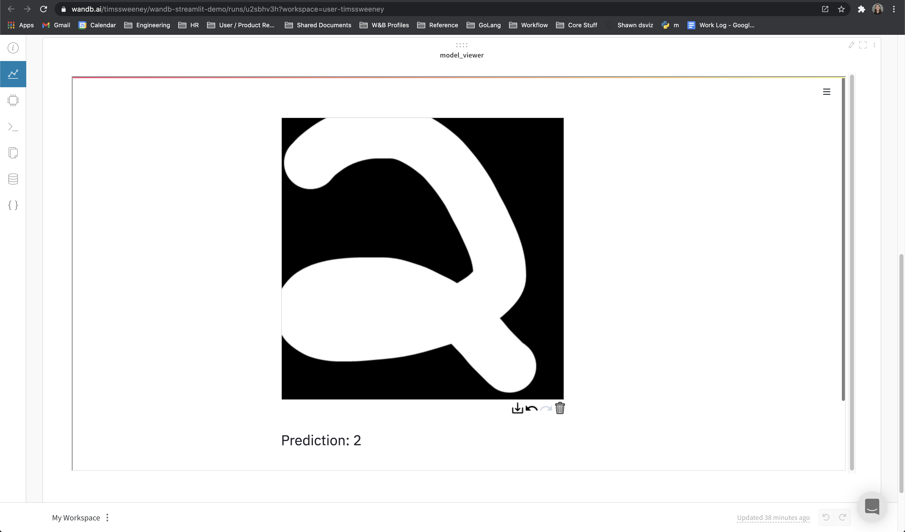

# WandB Streamlit Demo
----
In this demo, we embed a Streamlit app inside of WandB to act as a qualitative model evaluation tool

## Running the Demo

1. Install the dependencies: `pip install -r requirements.txt`
2. Train a few example models & embed a streamlit iframe: `python trainer.py`
3. Launch a streamlit application which serves realtime model predictions: `streamlit run viewer.py`
   - Note: this script serves the streamlit app locally. You will need to setup a public server for this example to work for others.

TODO: Setup a public streamlit app as a demo

## Interact with your model!

Navigate to the run page and you should be able to draw numbers which are passed to the trained model for that Run.

## Create a Report:

You can also embed these apps in a report to directly compare models!
 

